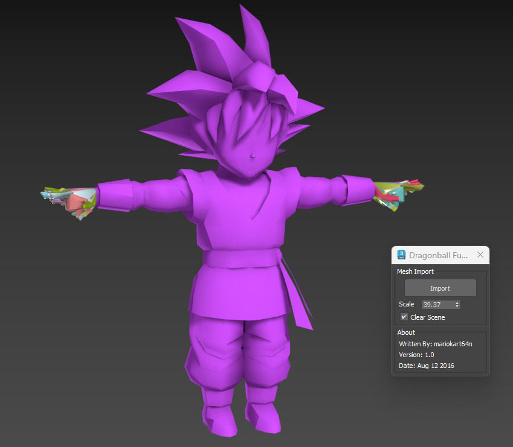

# Dragon Ball Fusions .jmdl Import Script for 3ds Max

## Overview

This MaxScript allows you to import 3D models from **Dragon Ball Fusions** for the Nintendo 3DS into Autodesk 3ds Max. The script reads `.jmdl` files, reconstructs the mesh geometry, and builds the skeleton hierarchy within 3ds Max.

**Note:** The imported mesh is not skinned or influenced by the skeleton, and material and texture assignments are not automatically applied.

## Features

- Imports mesh geometry from `.jmdl` files.
- Reconstructs the skeleton hierarchy.
- Provides scaling options for the imported model.

## Requirements

- Autodesk 3ds Max (compatible with MaxScript).
- Basic understanding of running scripts in 3ds Max.

## Installation

1. Copy the MaxScript code provided into a text editor.
2. Save the file with a `.ms` extension (e.g., `dbf_importer.ms`).
3. Place the script in a known location on your computer.

## Usage

1. **Launch 3ds Max.**
2. **Run the Script:**
   - Go to `Scripting` > `Run Script...` and navigate to the location where you saved `dbf_importer.ms`.
   - Select the script and click `Open`.
3. **Importer Dialog:**
   - A rollout named **"Dragonball Fusion"** will appear.
   - **Mesh Import Options:**
     - **Import Button:** Click to start the import process.
     - **Scale Spinner:** Adjust the scale of the imported model. Default is set to match the game's scale.
     - **Clear Scene Checkbox:** Check this option to remove all existing objects in the scene before importing.
   - **About Section:** Displays author information and version details.
4. **Importing a Model:**
   - Click the **Import** button.
   - A file dialog will appear. Navigate to the `.jmdl` file you wish to import.
   - Select the file and click `Open`.
5. **Post-Import:**
   - The mesh and skeleton hierarchy will be imported into the scene.
   - **Note:** The mesh will not be skinned to the skeleton, and materials/textures will need to be assigned manually.

## Limitations

- **No Skinning:** Meshes are not skinned or weighted to the skeleton. You will need to manually skin the mesh if required.
- **Material and Texture Assignment:** Materials and textures are not automatically assigned. Manual assignment is necessary.
- **Incomplete Feature Support:** Due to limited documentation on the `.jmdl` format, some features may not be fully supported.

## Troubleshooting

- **Script Errors:** Ensure that you have copied the script correctly and that there are no missing characters or syntax errors.
- **Incorrect Scaling:** Adjust the `Scale` spinner in the importer dialog to correct any scaling issues.
- **Missing Bones or Mesh Parts:** The script relies on the structure of the `.jmdl` file. If parts are missing, the file may be incomplete or corrupted.

## Disclaimer

This script is provided "as is" without warranty of any kind. Use it at your own risk. The author is not responsible for any damages or issues that may arise from using this script.
